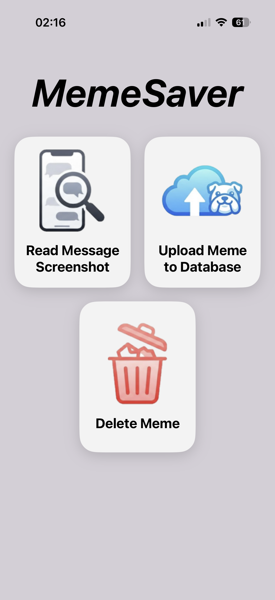
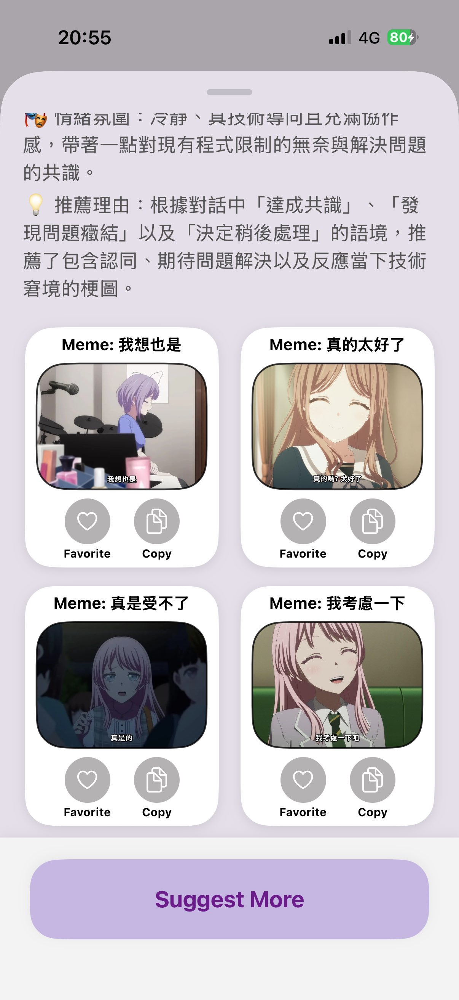
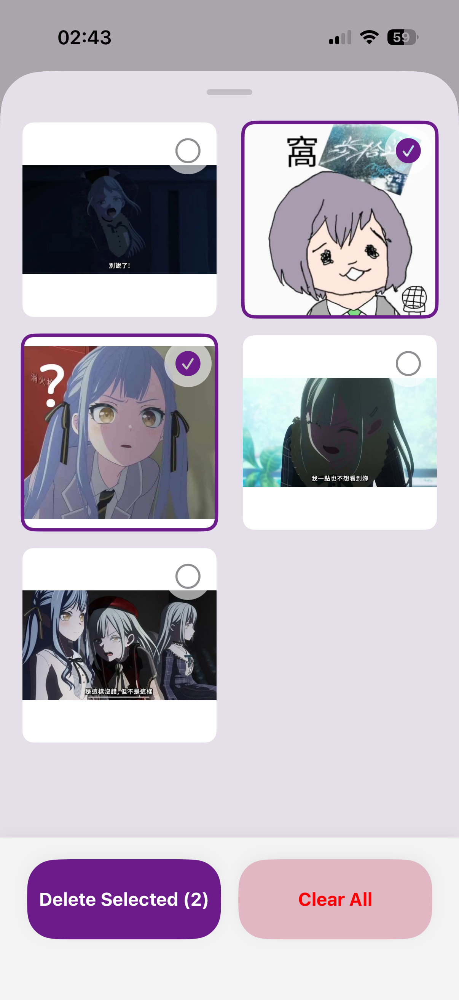

# MemeSaver

An intelligent iOS application that directly analyzes chat screenshots and recommends relevant memes based on the conversation context. 

## Overview
MemeSaver bridges the gap between everyday conversations and meme culture. By leveraging the multimodal capabilities of a Large Language Model (LLM), the app intelligently understands the context and emotional tone of a user's chat screenshot and suggests the most fitting memes to reply with. 

This project demonstrates a complete implementation of a modern iOS application, integrating local data management and cloud-based AI to provide a seamless user experience.

## Key Features
* **Multimodal Image Analysis**: Integrates the Google Gemini API to directly process chat screenshots, analyzing the conversational context without the need for local text extraction (OCR).
* **Contextual Meme Recommendation**: Performs semantic matching based on the LLM's understanding of the conversation to suggest the perfect meme.
* **Efficient Local Storage**: Manages the user's personal meme library using SwiftData, ensuring smooth performance and persistent data storage.
* **Modern & Responsive UI**: Built entirely with SwiftUI, featuring an intuitive interface for managing meme tags, categories, and viewing recommendations.

## Tech Stack
* **Language:** Swift
* **UI Framework:** SwiftUI
* **Local Database:** SwiftData
* **AI Integration:** Google Gemini API

## System Architecture Workflow
1. **Input:** The user imports a chat screenshot from their Photo Library.
2. **Analysis (Cloud):** The image is sent directly to the Gemini API, utilizing its multimodal capabilities to analyze the conversational context and emotional tone.
3. **Retrieval (Local):** Based on the LLM's output keywords, the app queries the SwiftData database to find matching user-saved memes.
4. **Output:** The best-matched memes are displayed on the SwiftUI interface.

## Screenshots
<p align="center">
  
  
  
</p>

## Requirements
* iOS 17.0+
* Xcode 15.0+

## Installation & Setup
1. Clone the repository:
```bash
   git clone https://github.com/PL-32003/MemeSaver-iOS.git
```

2. Open MemeSaver.xcodeproj in Xcode.
3. Add your Gemini API Key:
   * Locate the configuration file or environment variables setup in the project.
   * Insert your valid Google Gemini API Key.
4. Build and run the project on a simulator or a physical iOS device.
